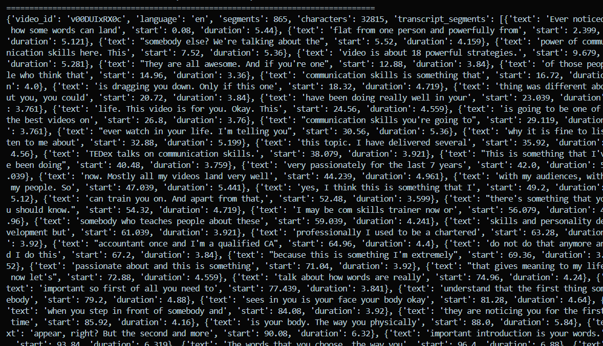
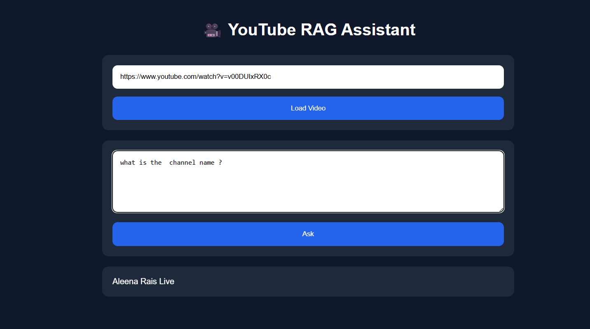
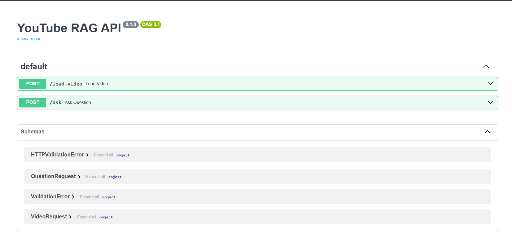

# 🎥 YouTube RAG Assistant

> Chat with any YouTube video using **Retrieval-Augmented Generation (RAG)** powered by **LangChain**, **FAISS**, **Hugging Face Embeddings**, **Ollama**, and **Qwen3**.


---

# 📌 Overview

YouTube RAG Assistant is an end-to-end **Retrieval-Augmented Generation (RAG)** application that enables users to ask natural language questions about any YouTube video.

Instead of relying solely on an LLM's knowledge, the system extracts the video's transcript, indexes it using vector embeddings, retrieves the most relevant context, and generates grounded answers using a local Large Language Model.

The project also extracts YouTube metadata such as:

- Video Title
- Channel Name
- Description
- Duration
- Upload Date
- Views

allowing users to ask both **content-related** and **metadata-related** questions.

---

# 🚀 Features

- 🎥 Load any public YouTube video
- 📝 Automatic transcript extraction
- 📄 Automatic metadata extraction
- ✂️ Intelligent transcript chunking
- 🧠 HuggingFace sentence embeddings
- ⚡ FAISS vector database
- 🔍 Semantic similarity search
- 🤖 Local LLM using Ollama + Qwen3
- 🌐 FastAPI REST backend
- 💻 HTML/CSS/JavaScript frontend
- 🔒 Runs completely locally
- 💰 No OpenAI API required

---

# 🏗️ System Architecture

```text
                    YouTube URL
                         │
                         ▼
          ┌──────────────────────────┐
          │ Transcript Extraction    │
          │ youtube-transcript-api   │
          └──────────────────────────┘
                         │
                         ▼
          ┌──────────────────────────┐
          │ Metadata Extraction      │
          │ yt-dlp                   │
          └──────────────────────────┘
                         │
                         ▼
          ┌──────────────────────────┐
          │ Recursive Character      │
          │ Text Splitter            │
          └──────────────────────────┘
                         │
                         ▼
          ┌──────────────────────────┐
          │ HuggingFace Embeddings   │
          │ all-MiniLM-L6-v2         │
          └──────────────────────────┘
                         │
                         ▼
          ┌──────────────────────────┐
          │ FAISS Vector Store       │
          └──────────────────────────┘
                         │
                         ▼
          ┌──────────────────────────┐
          │ Semantic Retriever       │
          └──────────────────────────┘
                         │
                         ▼
          ┌──────────────────────────┐
          │ Ollama + Qwen3           │
          └──────────────────────────┘
                         │
                         ▼
                   Final Answer
```

---

# 📂 Project Structure

```text
youtube-rag-assistant/
│
├── backend/
│   │
│   ├── api/
│   │   └── routes.py
│   │
│   ├── rag/
│   │   ├── youtube_loader.py
│   │   ├── text_splitter.py
│   │   ├── embeddings.py
│   │   ├── vector_store.py
│   │   ├── retriever.py
│   │   ├── prompt.py
│   │   ├── llm.py
│   │   └── chain.py
│   │
│   ├── utils/
│   │   └── youtube_utils.py
│   │
│   ├── vector_db/
│   │
│   ├── app.py
│   ├── config.py
│   └── requirements.txt
│
├── frontend/
│   ├── index.html
│   ├── style.css
│   └── script.js
│
├── assets/
│
├── .env.example
├── .gitignore
├── LICENSE
└── README.md
```

---

# ⚙️ Tech Stack

## Backend

- Python
- FastAPI
- LangChain
- FAISS
- Ollama
- Qwen3

## AI

- HuggingFace Embeddings
- sentence-transformers
- Retrieval-Augmented Generation

## Data

- youtube-transcript-api
- yt-dlp

## Frontend

- HTML
- CSS
- JavaScript

---

# 📦 Installation

## Clone Repository

```bash
git clone https://github.com/yourusername/youtube-rag-assistant.git

cd youtube-rag-assistant
```

---

## Create Virtual Environment

### Windows

```bash
python -m venv venv

venv\Scripts\activate
```

### Linux / macOS

```bash
python3 -m venv venv

source venv/bin/activate
```

---

## Install Dependencies

```bash
pip install -r backend/requirements.txt
```

---

# 🤖 Install Ollama

Download Ollama

https://ollama.com/download

Pull Qwen3

```bash
ollama pull qwen3:4b
```

Verify

```bash
ollama list
```

---

# ▶️ Run Backend

```bash
cd backend

uvicorn app:app --reload
```

Backend starts at

```
http://127.0.0.1:8000
```

Swagger Documentation

```
http://127.0.0.1:8000/docs
```

---

# 💻 Run Frontend

Open

```
frontend/index.html
```

or use VS Code Live Server.

---

# 🔗 API Endpoints

## Load Video

```
POST /load-video
```

Example Request

```json
{
    "url":"https://www.youtube.com/watch?v=VIDEO_ID"
}
```

Example Response

```json
{
    "status":"success",
    "video_id":"...",
    "title":"...",
    "channel":"...",
    "chunks":42
}
```

---

## Ask Question

```
POST /ask
```

Example Request

```json
{
    "question":"What is Retrieval Augmented Generation?"
}
```

Example Response

```json
{
    "question":"What is Retrieval Augmented Generation?",
    "answer":"..."
}
```

---

# 💡 Example Questions

### Metadata

- What is the title of this video?
- What is the channel name?
- Who uploaded this video?
- How long is the video?
- When was it uploaded?

### Transcript

- Summarize this video.
- What are the key concepts?
- Explain Retrieval-Augmented Generation.
- What are embeddings?
- What is vector search?
- What are the main takeaways?

---

# 🧠 RAG Pipeline

```
User Question
      │
      ▼
Metadata Question?
      │
 ┌────┴─────┐
 │          │
Yes         No
 │          │
Metadata    Retriever
 │          │
 └────┬─────┘
      ▼
Prompt Construction
      │
      ▼
Qwen3 (Ollama)
      │
      ▼
Answer
```

---

# 🛠️ Current Capabilities

✅ Transcript Extraction

✅ Metadata Extraction

✅ Semantic Search

✅ FAISS Indexing

✅ HuggingFace Embeddings

✅ Local LLM

✅ FastAPI Backend

✅ HTML Frontend

✅ Local Inference

---

# 🔮 Future Improvements

- Multi-video RAG
- Playlist RAG
- PDF Export
- Chat History
- Streaming Responses
- Source Highlighting
- Chrome Extension
- Dark Mode UI
- Docker Support
- Authentication
- PostgreSQL Integration
- Deployment on Render/Vercel

---


# 📸 Demo

<p align="center">
  
</p>

<p align="center">
  
</p>

<p align="center">
  
</p>

---

# 👨‍💻 Author

**Gaurav Dogra**


---

# 📄 License

This project is licensed under the MIT License.

---

# ⭐ If you found this project helpful

Consider giving this repository a ⭐ on GitHub!
